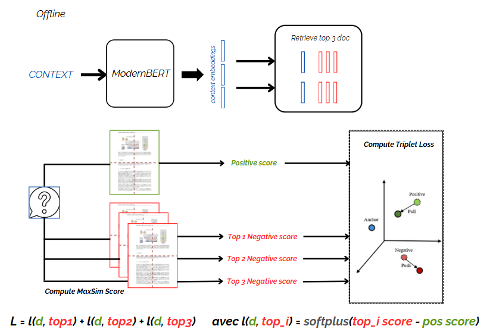

## **ColPali : Fine-tuning using multi hard negative pairwise loss**
### **Improving Multimodal Retrieval**  
*Hard negative mining, increasing training difficulty*

This fine-tuning project aims to enhance the ColPali multimodal model by addressing some of its inherent limitations in its training process. ColPali relies on a maximum similarity (MaxSim) calculation, performed between each image patch and each query token for every page, sequentially and independently. Training is based on in-batch contrastive learning between (q, d) — a query-positive document pair — and an incorrect document drawn from a negative batch, where the hardest negative is selected.

Although this method effectively separates the correct document from an incorrect yet seemingly relevant one, its performance is dependent on the difficulty of the negatives available within the batch.

To promote the retrieval of the correct page, we train on the three pages that are semantically the closest to the query using a multi hard negative pairwise loss approach between the positive document and each of the three hardest negatives. Instead of considering only a single hardest negative among a batch of size *k*, we compute a multi hard negative pairwise loss that takes into account each of the three hardest negatives from the entire dataset. This not only increases the training difficulty but also forces the model to focus on the semantic details that differentiate these very similar pages, ensuring a more discriminative retrieval process.

This approach enables us to simultaneously separate the positive page for a query *q* from its three most semantically similar (yet incorrect) pages.

> **Note:** This notebook requires an A100 40GB GPU for execution.

---

## Fine Tuning Pipeline

---

#### **Key Features:**

1. **Hard Negative Mining**  
   Using FAISS GPU, we pre-generated a list of IDs for the 3 hardest negatives for each page in the ColPali training dataset. To obtain high-quality negative samples, we first generate a textual context for each page using **vLLM**. These contexts, which describe the content of the page, are then embedded using **ModernBERT**. Based on these embeddings, FAISS GPU is used to retrieve the three pages that are contextually closest to each document, ensuring that the negatives are as challenging as possible.

2. **Multi hard negative pairwise loss**  
   We define our loss function as a multi hard negative pairwise loss adapted to multimodal retrieval. The loss is designed to ensure that the similarity between the query and the positive document is higher than the similarity between the query and each of the negative documents. This formulation forces the model to focus on fine-grained semantic differences between very similar pages by explicitly considering the top three hardest negatives in the entire dataset.

---

### Resources

This project is inspired by the following research paper:

- [ColPali: Retrieval-Augmented Generation](https://arxiv.org/pdf/2407.01449): A framework for multimodal information retrieval and reasoning.
